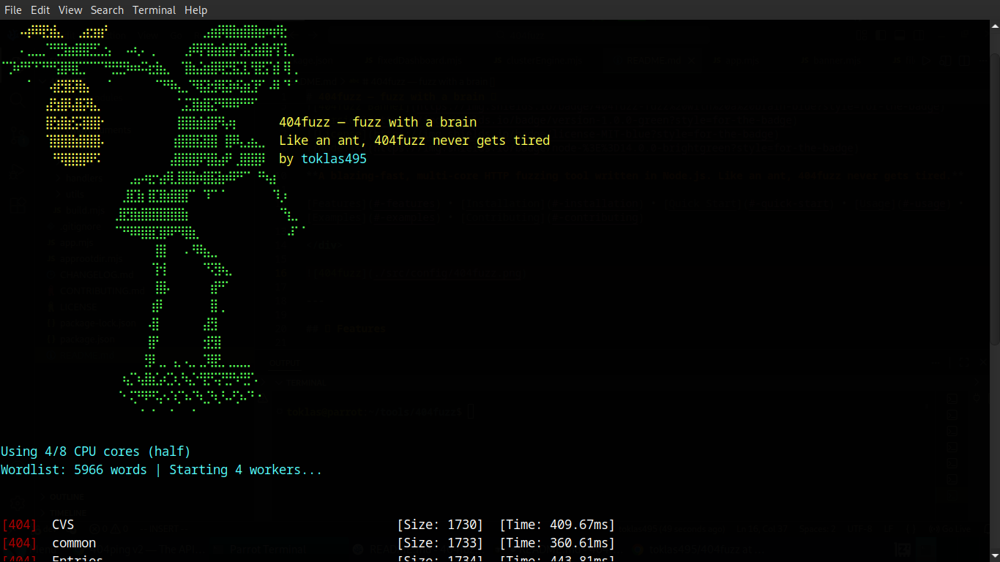

# 404fuzz — fuzz with a brain 🧠

<div align="center">


**A blazing-fast, multi-core HTTP fuzzing tool written in Node.js. Like an ant, 404fuzz never gets tired.**

[Features](#-features) • [Installation](#-installation) • [Quick Start](#-quick-start) • [Usage](#-usage) • [Examples](#-examples) • [Contributing](#-contributing)

</div>

---



## 🚀 Features

- ⚡ **Blazing Fast**: Multi-core cluster architecture for maximum speed
- 🎯 **Smart CPU Usage**: Control CPU cores with `--cores` option (half, all, single, or number)
- 📊 **Real-time Dashboard**: Live statistics with RPS tracking, progress, and ETA
- 🎨 **Professional Output**: Color-coded status codes and clean formatting
- 🛡️ **Robust Error Handling**: Comprehensive error messages with helpful suggestions
- 🔄 **Graceful Shutdown**: Proper Ctrl+C handling with cleanup
- 📝 **Wordlist Validation**: Validates wordlist before starting fuzzing
- 🎭 **Beautiful Banner**: Professional ASCII art banner on startup
- 🔧 **Easy to Use**: Simple CLI interface similar to ffuf

## 📋 Table of Contents

- [Installation](#-installation)
- [Quick Start](#-quick-start)
- [Usage](#-usage)
- [Examples](#-examples)
- [How It Works](#-how-it-works)
- [Performance](#-performance)
- [Contributing](#-contributing)
- [License](#-license)
- [Author](#-author)

## 💻 Installation

### Prerequisites

- Node.js >= 14.0.0
- npm or yarn

### Install from Source

1. **Clone the repository:**
   ```bash
   git clone https://github.com/toklas495/404fuzz.git
   cd 404fuzz
   ```

2. **Install dependencies:**
   ```bash
   npm install
   ```

3. **Build and link globally:**
   ```bash
   npm run build
   ```

   This will make `404fuzz` available globally on your system.

### Verify Installation

```bash
404fuzz
```

You should see the 404fuzz banner!

## 🏃 Quick Start

```bash
# Basic fuzzing
404fuzz fuzz https://example.com/FUZZ -w wordlist.txt

# With custom HTTP method
404fuzz fuzz https://api.example.com/FUZZ -w wordlist.txt -X POST

# Control CPU cores (use half of available cores)
404fuzz fuzz https://example.com/FUZZ -w wordlist.txt --cores half
```

## 📖 Usage

### Basic Syntax

```bash
404fuzz fuzz <url> [options]
```

### Required Arguments

- `<url>` - Target URL with `FUZZ` placeholder (e.g., `https://example.com/FUZZ`)
- `-w, --wordlist <path>` - Path to wordlist file

### Options

| Option | Short | Description | Default |
|--------|-------|-------------|---------|
| `--method` | `-X` | HTTP method (GET, POST, PUT, DELETE) | GET |
| `--wordlist` | `-w` | Wordlist file path | *required* |
| `--header` | `-H` | Custom headers (format: `key:value`) | - |
| `--data` | `-d` | Request body (JSON format) | - |
| `--timeout` | - | Request timeout in milliseconds | - |
| `--insecure` | `-k` | Allow insecure SSL connections | false |
| `--delay` | - | Delay between requests (seconds) | 0 |
| `--concurrent` | `-t` | Number of concurrent requests | 500 |
| `--cores` | `-c` | CPU cores to use (`half`, `all`, `single`, or number) | half |
| `--match_status` | `-m` | Match HTTP status codes (comma-separated) | - |
| `--filter_status` | `-f` | Filter HTTP status codes (comma-separated) | - |
| `--json` | - | Output results in JSON format (JSONL - one JSON object per line) | false |
| `--output` | `-o` | Save results to file (works with both JSON and normal output) | - |

### CPU Core Control

The `--cores` option allows you to control CPU utilization:

- `half` - Uses half of available CPU cores (default, recommended)
- `all` - Uses all available CPU cores (maximum speed)
- `single` - Uses only 1 core (minimal resource usage)
- `<number>` - Uses specific number of cores (e.g., `2`, `4`, `8`)
  - Automatically capped at maximum available cores

**Example:**
```bash
# Use 4 cores
404fuzz fuzz https://example.com/FUZZ -w wordlist.txt -c 4

# Use all cores (maximum speed)
404fuzz fuzz https://example.com/FUZZ -w wordlist.txt --cores all

# Use single core (lightweight)
404fuzz fuzz https://example.com/FUZZ -w wordlist.txt --cores single
```

## 📚 Examples

### Basic Directory Fuzzing

```bash
404fuzz fuzz https://example.com/FUZZ -w /path/to/wordlist.txt
```

### API Endpoint Fuzzing with POST

```bash
404fuzz fuzz https://api.example.com/user/FUZZ \
  -X POST \
  -d '{"email":"FUZZ@example.com"}' \
  -w emails.txt \
  -H "Content-Type: application/json" \
  -H "Authorization: Bearer token123"
```

### Fuzzing with Custom Headers

```bash
404fuzz fuzz https://api.example.com/FUZZ \
  -w wordlist.txt \
  -H "User-Agent: 404fuzz/1.0" \
  -H "X-API-Key: your-key-here"
```

### Match Specific Status Codes

```bash
# Only show 200, 301, 403 status codes
404fuzz fuzz https://example.com/FUZZ \
  -w wordlist.txt \
  -m "200,301,403"
```

### Filter Out Status Codes

```bash
# Hide 404 and 500 status codes
404fuzz fuzz https://example.com/FUZZ \
  -w wordlist.txt \
  -f "404,500"
```

### Insecure SSL Connections

```bash
404fuzz fuzz https://example.com/FUZZ \
  -w wordlist.txt \
  -k
```

### Custom Timeout and Delay

```bash
404fuzz fuzz https://example.com/FUZZ \
  -w wordlist.txt \
  --timeout 5000 \
  --delay 0.1
```

### Control Concurrency

```bash
# Use 1000 concurrent requests
404fuzz fuzz https://example.com/FUZZ \
  -w wordlist.txt \
  -t 1000
```

### JSON Output

```bash
# Output results in JSON format (JSONL - one JSON object per line)
404fuzz fuzz https://example.com/FUZZ \
  -w wordlist.txt \
  --json

# JSON output format:
# {"url":"https://example.com/admin","status":200,"size":1234,"words":45,"lines":10,"time":123,"fuzz":"admin"}
# {"url":"https://example.com/api","status":403,"size":567,"words":12,"lines":3,"time":89,"fuzz":"api"}

# Save JSON output to file using --output (recommended - faster streaming)
404fuzz fuzz https://example.com/FUZZ \
  -w wordlist.txt \
  --json \
  --output results.json

# Save normal output to file
404fuzz fuzz https://example.com/FUZZ \
  -w wordlist.txt \
  --output results.txt

# Or use shell redirection (slower)
404fuzz fuzz https://example.com/FUZZ \
  -w wordlist.txt \
  --json > results.json
```

## 🔧 How It Works

### Architecture

404fuzz uses a **multi-core cluster architecture** to maximize performance:

1. **Primary Process**: Manages workers, displays dashboard, aggregates statistics
2. **Worker Processes**: Each worker runs on a separate CPU core
3. **Wordlist Sharding**: Wordlist is automatically distributed across workers
4. **Real-time Aggregation**: RPS and statistics are aggregated from all workers

### Fuzzing Process

1. **Initialization**:
   - Validates wordlist file
   - Calculates CPU cores to use
   - Counts wordlist entries for progress tracking
   - Displays banner and dashboard

2. **Worker Distribution**:
   - Forks worker processes (one per CPU core)
   - Distributes wordlist entries across workers using modulo sharding
   - Each worker processes its assigned entries independently

3. **Request Execution**:
   - Workers replace `FUZZ` placeholder with wordlist entries
   - Sends HTTP requests with configurable concurrency
   - Tracks success/error rates
   - Filters/matches responses based on status codes

4. **Statistics Aggregation**:
   - Workers send RPS data to primary process
   - Dashboard updates in real-time (250ms refresh)
   - Final statistics displayed on completion

### Performance Optimizations

- **Connection Pooling**: HTTP keep-alive connections for faster requests
- **Async/Await**: Non-blocking I/O for maximum throughput
- **Efficient Sharding**: Even distribution of work across cores
- **Minimal Overhead**: Lightweight dashboard updates

## ⚡ Performance

404fuzz is designed for speed:

- **Multi-core**: Utilizes all available CPU cores efficiently
- **High Concurrency**: Default 500 concurrent requests per worker
- **Optimized Network**: HTTP keep-alive and connection pooling
- **Fast Dashboard**: 250ms refresh rate for smooth updates


## 🤝 Contributing

Contributions are welcome! Please feel free to submit a Pull Request.

1. Fork the repository
2. Create your feature branch (`git checkout -b feature/AmazingFeature`)
3. Commit your changes (`git commit -m 'Add some AmazingFeature'`)
4. Push to the branch (`git push origin feature/AmazingFeature`)
5. Open a Pull Request

### Development Setup

```bash
# Clone repository
git clone https://github.com/toklas495/404fuzz.git
cd 404fuzz

# Install dependencies
npm install

# Make executable
chmod +x app.mjs

# Link globally for testing
npm link
```

## 📝 License

This project is licensed under the MIT License - see the [LICENSE](LICENSE) file for details.

## 👤 Author

**toklas495**

- 🐦 Twitter: [@toklas495](https://twitter.com/toklas495)
- 📝 Medium: [@toklas495](https://medium.com/@toklas495)
- 💻 Dev.to: [@toklas495](https://dev.to/toklas495)
- 🐙 GitHub: [@toklas495](https://github.com/toklas495)

---

<div align="center">

**Made with ❤️ by toklas495**

*Like an ant, 404fuzz never gets tired* 🐜

[⭐ Star this repo](https://github.com/toklas495/404fuzz) • [🐛 Report Bug](https://github.com/toklas495/404fuzz/issues) • [💡 Request Feature](https://github.com/toklas495/404fuzz/issues)

</div>
